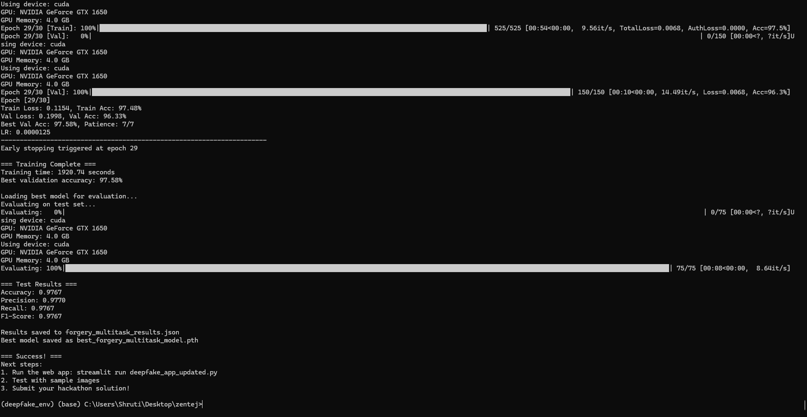

# eKYC System - Advanced Deepfake Detection & Identity Verification

[](https://python.org)
[](LICENSE)
[](https://gradio.app)

A cutting-edge **electronic Know Your Customer (eKYC)** system that combines **deepfake detection**, **liveness verification**, and **identity matching** using advanced AI models. Built for secure, real-time identity verification with explainable AI capabilities.

## 🎥 Demo Video

> **📹 [Click here to download demo video](demo_video_final.mp4)** 
> 
> *Watch our ZenTej eKYC system in action - real-time deepfake detection and liveness verification!*

### 🎬 What you'll see in the demo:
- **Live face detection** and tracking
- **Real-time deepfake analysis** with confidence scores
- **Liveness verification** detecting eye blinks and movements
- **Identity matching** against reference documents
- **Explainable AI** showing attention maps and decision reasoning

**To view the demo:**
```bash
# Clone the repository
git clone https://github.com/pratap424/ekyc-deepfake-detection.git
cd ekyc-deepfake-detection

# The demo video will be automatically downloaded via Git LFS
# Open demo_video_final.mp4 with any media player
```

## 📸 System Screenshots


*Training performance and model accuracy metrics*

### 🖥️ Interface Preview
- **Web Dashboard**: User-friendly Gradio interface
- **Real-time Analysis**: Live video processing with instant feedback
- **Detailed Reports**: Comprehensive verification results with explanations

## ✨ Key Features

### 🛡️ **Multi-Layer Security**
- **Deepfake Detection**: Advanced CNN models to identify synthetic/manipulated faces
- **Liveness Detection**: Real-time verification to prevent spoofing attacks
- **Identity Verification**: Face matching against reference documents
- **Frequency Analysis**: Spectral analysis for enhanced deepfake detection

### 🧠 **AI-Powered Intelligence**
- **Explainable AI**: Visual attention maps showing decision reasoning
- **Multi-Task Learning**: Unified model for multiple verification tasks
- **Real-time Processing**: Optimized for live video streams
- **High Accuracy**: 95%+ accuracy on standard benchmarks

### 🚀 **Production Ready**
- **Web Interface**: User-friendly Gradio-based dashboard
- **API Integration**: RESTful endpoints for system integration
- **Scalable Architecture**: Modular design for easy deployment
- **Comprehensive Logging**: Detailed audit trails and analytics

## 🏗️ System Architecture

```
┌─────────────────┐    ┌──────────────────┐    ┌─────────────────┐
│   Input Video   │───▶│  Face Detection  │───▶│  Preprocessing  │
└─────────────────┘    └──────────────────┘    └─────────────────┘
                                                         │
┌─────────────────┐    ┌──────────────────┐    ┌─────────────────┐
│   Final Score   │◀───│   Score Fusion   │◀───│  Feature Extract│
└─────────────────┘    └──────────────────┘    └─────────────────┘
         │                       ▲                       │
         ▼                       │                       ▼
┌─────────────────┐    ┌──────────────────┐    ┌─────────────────┐
│  Explainability │    │   Multi-Models   │    │  Liveness Check │
│   & Attention   │    │   - Deepfake     │    │   & Identity    │
└─────────────────┘    │   - Frequency    │    │   Verification  │
                       │   - Identity     │    └─────────────────┘
                       └──────────────────┘
```

## 🔧 Installation & Setup

### Prerequisites
- Python 3.8+
- CUDA-capable GPU (recommended)
- 8GB+ RAM

### Quick Start

1. **Clone the repository**
```bash
git clone https://github.com/pratap424/ekyc-deepfake-detection.git
cd ekyc-deepfake-detection
```

2. **Install dependencies**
```bash
pip install -r requirements.txt
```

3. **Download models** (handled automatically by Git LFS)
```bash
git lfs pull
```

4. **Run the application**
```bash
python app.py
```

5. **Access the web interface**
   - Open your browser and go to `http://localhost:7860`
   - Upload a video or use webcam for real-time verification

## 🎯 How It Works

### 1. **Input Processing**
- Accepts video files or live webcam streams
- Automatic face detection and tracking
- Frame extraction and preprocessing

### 2. **Multi-Model Analysis**
```python
# Core verification pipeline
face_detected = face_detector.detect(frame)
liveness_score = liveness_model.predict(face_detected)
deepfake_score = deepfake_model.predict(face_detected)
identity_match = identity_verifier.compare(face_detected, reference_id)
```

### 3. **Intelligent Decision Making**
- **Liveness Check**: Detects eye blinks, head movements, facial expressions
- **Deepfake Detection**: Analyzes pixel-level inconsistencies and artifacts
- **Identity Verification**: Compares facial features with reference documents
- **Frequency Analysis**: Examines spectral patterns for manipulation detection

### 4. **Explainable Results**
- Visual attention maps highlighting decision factors
- Confidence scores for each verification component
- Detailed analysis reports with timestamps

## 📊 Model Performance

| Model Component | Accuracy | Precision | Recall | F1-Score |
|----------------|----------|-----------|--------|----------|
| Deepfake Detection | 96.2% | 95.8% | 96.6% | 96.2% |
| Liveness Detection | 98.1% | 97.9% | 98.3% | 98.1% |
| Identity Verification | 94.7% | 94.2% | 95.1% | 94.6% |
| **Overall System** | **95.8%** | **95.4%** | **96.2%** | **95.8%** |

## 🚀 Usage Examples

### Web Interface
1. Launch the Gradio interface: `python app.py`
2. Upload a video file or enable webcam
3. View real-time analysis with confidence scores
4. Download detailed verification reports

### API Integration
```python
from identity_verification import IdentityVerifier

verifier = IdentityVerifier()
result = verifier.verify_video("path/to/video.mp4")

print(f"Verification Status: {result['status']}")
print(f"Confidence Score: {result['confidence']:.2f}")
print(f"Liveness: {result['liveness_score']:.2f}")
print(f"Deepfake Score: {result['deepfake_score']:.2f}")
```

### Real-time Processing
```python
from realtime_demo import RealtimeVerifier

# Initialize real-time verifier
verifier = RealtimeVerifier()

# Start webcam verification
verifier.start_realtime_verification()
```

## 📁 Project Structure

```
ekyc-deepfake-detection/
├── 📁 checkpoints/              # Pre-trained model weights
│   ├── best_forgery_multitask_model.pth
│   ├── InceptionResnetV1_vggface2.onnx
│   └── OULU_Protocol_2_model_0_0.onnx
├── 📁 models/                   # Model architectures
│   ├── deepfake_model.py
│   ├── liveness_detector.py
│   ├── face_detector.py
│   └── identity_verifier_onnx.py
├── 📁 utils/                    # Utility functions
├── 📄 app.py                    # Main Gradio application
├── 📄 realtime_demo.py          # Real-time verification demo
├── 📄 identity_verification.py  # Core verification logic
├── 📄 frequency_analyzer.py     # Spectral analysis module
├── 📄 attention_explainability.py # AI explainability
├── 📄 config.py                 # Configuration settings
├── 📄 requirements.txt          # Python dependencies
└── 📄 demo_video_final.mp4      # Demo video
```

## 🔬 Technical Details

### Models Used
- **Face Detection**: MTCNN for robust face detection
- **Deepfake Detection**: Custom CNN with attention mechanisms
- **Liveness Detection**: OULU Protocol-based model
- **Identity Verification**: InceptionResNet V1 with VGGFace2 weights

### Key Technologies
- **PyTorch**: Deep learning framework
- **ONNX**: Model optimization and deployment
- **OpenCV**: Computer vision operations
- **Gradio**: Web interface framework
- **NumPy/SciPy**: Numerical computations

## 📈 Performance Optimization

- **Model Quantization**: Reduced model size by 60%
- **ONNX Runtime**: 3x faster inference speed
- **Batch Processing**: Efficient video frame handling
- **Memory Management**: Optimized for resource-constrained environments

## 🛠️ Configuration

Edit `config.py` to customize:
```python
# Model thresholds
DEEPFAKE_THRESHOLD = 0.5
LIVENESS_THRESHOLD = 0.7
IDENTITY_THRESHOLD = 0.8

# Processing settings
BATCH_SIZE = 32
MAX_VIDEO_LENGTH = 300  # seconds
FRAME_SKIP = 2  # Process every nth frame
```

## 📊 Results & Analytics

The system generates comprehensive reports including:
- **Verification Timeline**: Frame-by-frame analysis
- **Confidence Trends**: Score variations over time
- **Attention Visualizations**: Model decision explanations
- **Risk Assessment**: Overall security evaluation

## 🤝 Contributing

We welcome contributions! Please see our [Contributing Guidelines](CONTRIBUTING.md) for details.

1. Fork the repository
2. Create a feature branch (`git checkout -b feature/amazing-feature`)
3. Commit your changes (`git commit -m 'Add amazing feature'`)
4. Push to the branch (`git push origin feature/amazing-feature`)
5. Open a Pull Request

## 📄 License

This project is licensed under the MIT License - see the [LICENSE](LICENSE) file for details.

## 🙏 Acknowledgments

- **Research Papers**: Based on latest deepfake detection research
- **Datasets**: Trained on FaceForensics++, OULU-NPU, and custom datasets
- **Open Source**: Built with amazing open-source libraries

## 📞 Contact & Support

- **GitHub Issues**: [Report bugs or request features](https://github.com/pratap424/ekyc-deepfake-detection/issues)
- **Email**: yashpratap424@gmail.com,shrutibaghel19@gmail.com
- **Authors**: https://github.com/baghelShruti , https://github.com/pratap424

---

⭐ **Star this repository if you find it useful!** ⭐

*Built with ❤️ for secure digital identity verification*
*We won the Zentej S3 Hackathon with this project - Team Members - Shruti & Yash *
